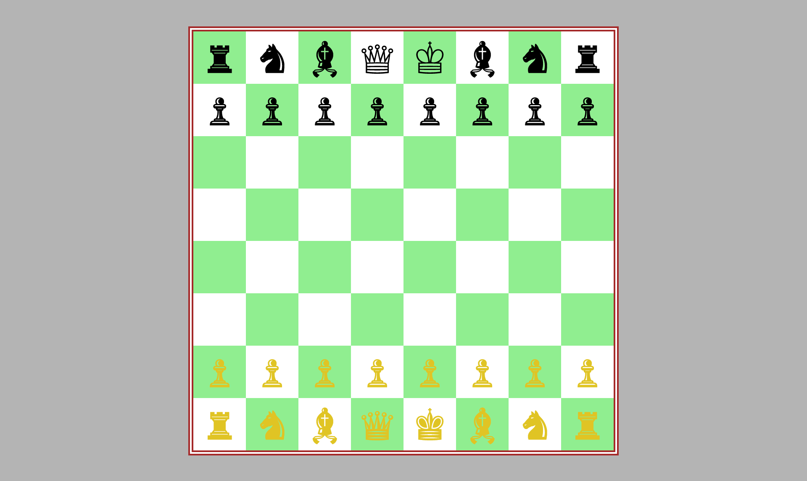

# ♟️ Chessboard Grid Layout

A clean and elegant chessboard layout created using **HTML** and **CSS Grid**.  
This is one of my first hands-on projects to understand how grid systems work in real-world layouts. 🧠💡

## 📸 Demo

  

## 🧰 Tech Stack

- 🟧 HTML5  
- 🎨 CSS3  
- 🧱 CSS Grid Layout  

## 🚀 Features

- 🎯 8x8 Chessboard using pure HTML & CSS  
- 👑 Unicode chess pieces placed accurately  
- 💡 Clean structure to practice and understand grid  

## 📁 File Structure

chessboardlayout-project/
├── index.html 
├── style.css 
├── chessBoardLayout.png 
└── README.md

## 🔗 Try It Out

👉 [Live Demo on GitHub Pages](https://your-username.github.io/chessboard-project/)  

## 🧠 What I Learned

- ✅ Basics of **CSS Grid**
- 🧼 Structuring layouts cleanly
- 🎯 Making pixel-perfect alignment with minimal code

## 📝 License

This project is licensed under the **MIT License**.  
Feel free to use, modify, and share it as you wish! 🫶

## 😎 Connect With Me

Made with ❤️ by **Rakesh Raj S**  
📫 [rakeshraj12531@gmail.com](mailto:rakeshraj12531@gmail.com)  
🔗 [LinkedIn – rakesh531](https://www.linkedin.com/in/rakesh531)

---

### 🌟 Don’t forget to star this repo if you like it!
